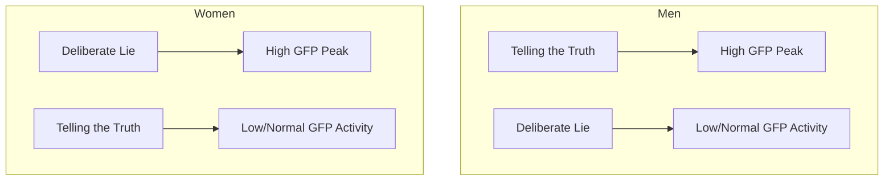
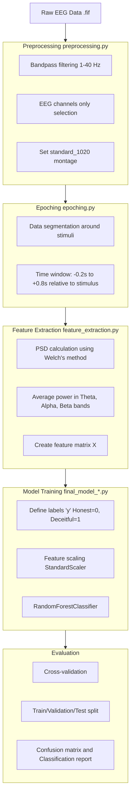

# 🧠 Neuro-Lie-Detector: EEG-Based Truth and Deception Classifier  

## 1️⃣ Introduction  

The goal of this project is the **analysis of electroencephalographic (EEG) data** to develop a **machine learning model** capable of distinguishing whether a study participant is telling the truth or **deliberately lying**.  

The project is based on an experimental paradigm inspired by the **Concealed Information Test (CIT)**.  
In this approach, brain responses to personally relevant stimuli are analyzed to detect so-called **“guilty knowledge”**, i.e., deliberate deception.  

For EEG signal processing and analysis, the following tools were used:  
- 📦 **mne-python** – for EEG signal preprocessing and filtering,  
- 🌲 **scikit-learn (Random Forest)** – to build a classifier distinguishing between “truth” and “lie” states.  

---

## 2️⃣ Conceptual Overview  

### ⚡ Electroencephalography (EEG)  

**EEG** is a non-invasive method for measuring the brain’s electrical activity using electrodes placed on the scalp.  
It records the cumulative **postsynaptic potentials** generated by neurons, allowing the analysis of brain states **in real time** with high temporal resolution.  

---

# 🔍 2️⃣ Conceptual Overview: ERP, P300, and Research Findings   

---

## 🧩 2.1. Event-Related Potentials (ERP) and the P300 Wave  

**Event-Related Potentials (ERP)** are measurable changes in the EEG signal that represent the brain’s **direct response to a specific, discrete stimulus**  
(e.g., the presentation of a question, image, or sound).  
ERP analysis enables tracking of cognitive processes with **millisecond precision**, making it one of the most powerful tools in cognitive neuroscience.  

---

### ⚡ The P300 (P3b) Wave — The Key to Detecting Deception  

The **P300** (or **P3b**) wave is one of the most extensively studied ERP components. It is characterized by:  

- 🔺 A **positive peak** in the EEG signal, appearing approximately **300–600 ms after stimulus onset**.  
- 🧠 A **link to cognitive processes** such as **stimulus evaluation** and **working memory updating**.  
- 📈 **Higher amplitude** in response to stimuli that are **rare, unexpected, or personally significant**,  
  such as one’s own name, date of birth, or familiar faces.  

> 💡 **In the context of lie detection:**  
> The P300 wave is considered a **neurological marker of recognition**, even when the subject attempts to conceal their knowledge.  

---

## 📊 2.2. Hypothesis vs. Actual Findings (EDA)  

### 🧪 Classical Hypothesis  
The standard hypothesis in **CIT (Concealed Information Test)** research assumes that:  
> 👉 A significant stimulus (e.g., true personal information) elicits a **stronger P300 response**,  
> regardless of whether the participant is **telling the truth** or **deliberately lying**.  

---

### 📈 Findings from Exploratory Data Analysis (EDA)  

Within this project, an **Exploratory Data Analysis (EDA)** was conducted — detailed in the notebook  
📓 *`eda_presentation.ipynb`*.  


Analysis of **Global Field Power (GFP)** — a measure of the overall strength of EEG activity — revealed **striking gender differences**:  

#### 👨 In Men  
- A distinct **GFP peak** was observed during **truth-telling** (e.g., confirming one’s true identity).  
- The response to **deliberate deception** was **significantly weaker**.  

#### 👩 In Women  
- The pattern was **reversed** — a strong **GFP peak** appeared **during lying**.  
- Truth-telling produced a **flatter and more stable response**.  

---

## 🧠 Key Findings and Implications  

This discovery has **critical implications for model development**.  
Since EEG response patterns differ **fundamentally between genders**,  
a **“one-model-fits-all”** approach proves **inefficient**.  

Therefore, the repository includes a dedicated testing script:  
📄 **`model_females_only.py`**  
➡️ It trains a classifier **exclusively on female participants**,  
to determine whether the model can capture the **specific neural pattern associated with deception**  
and whether this improves overall accuracy.  

---

📘 *Summary:*  
The experiment revealed that **participant gender** significantly influences the neural signatures of truth and deception —  
opening new directions for research in **the neuropsychology of lying** and **personalized EEG-based modeling**.  

---

### 📊 Power Spectral Density (PSD)  

**PSD** describes how the energy of the EEG signal is distributed across different **frequency bands**.  
PSD analysis allows us to assess whether **lying** and **truth-telling** involve distinct activity levels in certain bands:  

| Band | Range (Hz) | Neurophysiological Significance |
|:------|:------------:|:-------------------------------|
| **Theta** | 4–8 | Memory processes, focused attention |
| **Alpha** | 8–13 | Relaxation, inhibition of irrelevant information |
| **Beta** | 13–30 | Active thinking, stress, concentration |

In this project, the **input features for the AI model** are defined as the **average signal power** within these frequency bands.

---



# ⚙️ 3️⃣ Project Description and Workflow  

---

## 🧠 3.1. Experimental Paradigm  

In the experiment, participants were presented with a **series of cognitive tasks** where they were asked to **confirm or deny** displayed personal information (e.g., name, surname, date of birth).  
Each task required a **“Yes”** or **“No”** response, where the meaning of **truth or deception** depended on the context of a given block.  

The experiment was divided into **four main blocks**, differing in the relationship between the stimulus and the expected response:  

| 🔢 **Block** | 🧩 **Task Description** | 💬 **Required Response** | 🧠 **Expected State** |
|:------------:|:----------------------:|:------------------------:|:--------------------:|
| **Block 1** | Presentation of **true personal data** | “Yes” (confirmation) | ✅ **TRUTH** |
| **Block 2** | Presentation of **true personal data** | “No” (denial) | ❌ **LIE** |
| **Block 3** | Presentation of **false identity data** | “Yes” (confirmation) | ❌ **LIE** |
| **Block 4** | Presentation of **false identity data** | “No” (denial) | ✅ **TRUTH** |

---

### 💾 Data Structure  

The collected EEG data were preprocessed and saved in **`.fif` format**,  
including labels that describe the participant’s cognitive state during each task:  

- 🟢 **HONEST** → responses consistent with the truth (Blocks **1** and **4**)  
- 🔴 **DECEITFUL** → false responses, i.e., deliberate lies (Blocks **2** and **3**)  

> 💡 This labeling allows for quick grouping of trials based on the participant’s cognitive condition even at the raw data stage.  

---

## 🔄 3.2. Data Processing Pipeline  

The entire EEG analysis process — from raw signal to AI model prediction — has been **fully automated**.  
The processing pipeline includes the following stages:  

1. 🧹 **Loading and Cleaning EEG Data**  
   - Removal of artifacts (e.g., eye blinks, eye movements)  
   - Band-pass filtering (e.g., 1–40 Hz)  

2. ⚙️ **Data Segmentation (Epoching)**  
   - Splitting continuous EEG signals into short segments corresponding to individual stimuli  

3. 📊 **Feature Extraction**  
   - Calculation of **Power Spectral Density (PSD)** for **Theta**, **Alpha**, and **Beta** frequency bands  
   - Computing average power values for each EEG channel  

4. 🤖 **Training the Classification Model**  
   - Using a **Random Forest** algorithm to distinguish between **HONEST** and **DECEITFUL** states  

5. 🔍 **Validation and Evaluation**  
   - Calculating accuracy, confusion matrix, and ROC curve  
   - Comparing results across groups (e.g., gender, EEG channels, frequency bands)  

---



📘 *Summary:*  
The experimental section combines a **tightly controlled cognitive paradigm** with an **advanced EEG processing pipeline**,  
enabling automated classification of brain responses into **truth** and **lie** categories.  

---

## 4. Repository Structure

```
├── dataset/                  # (Required locally) Folder for raw EEG data (.fif)
├── src/                      # Python modules containing data processing logic
│   ├── analysys_utils.py     # Utility functions for data loading and analysis
│   ├── epoching.py           # Script for epoch creation (data segmentation)
│   ├── feature_extraction.py # Script for PSD feature extraction
│   └── preprocessing.py      # Script for initial data cleaning
├── notebooks/ 
│   └── eda_presentation.ipynb    # Jupyter Notebook for Exploratory Data Analysis (EDA)
├── final_model_both.py       # Main script: trains model on all participants (Train/Val/Test split)
├── final_model_cv.py         # Main script: trains model on all participants using Cross-Validation (CV)
├── model_females_only.py     # Script for training a model on female participants only (based on EDA findings)
└── requirements.txt          # List of Python dependencies
```

---

# 🧩 5️⃣ Installation and Execution  

## ⚙️ 5.1. Prerequisites  

Before you begin, make sure you have the following installed:  

- 🐍 **Python 3.8+**  
- 🔧 **Git**  

## 🚀 5.2. Installation Steps  

1.  Clone the repository:  
    ```bash
    git clone https://github.com/xVarmondx/neuro-lie-detector.git
    cd neuro-lie-detector
    ```

2.  Create and activate a virtual environment:  
    ```bash
    python -m venv venv

    # Na Linux/MacOS
    source venv/bin/activate

    # Na Windows:
    venv\Scripts\activate
    ```

3.  Install the required libraries:  
    ```bash
    pip install -r requirements.txt
    ```

### 4️⃣ 🔑 **Key Step: Data Preparation**

For the project to function properly, you must **manually download the EEG experimental data**.  

---

#### 📥 Downloading the Data  

1. Create a **`dataset/`** folder in the project’s root directory (`neuro-lie-detector/`).  
2. Inside the `dataset/` folder, create **subfolders** for each participant,  
   named with their unique **UUID**.  
3. Upload the corresponding `.fif` EEG data files into each participant’s subfolder.  

📎 **Data Link:**  
[Google Drive – Neuro-Lie-Detector Dataset](https://drive.google.com/file/d/18YR2hdIq5lfktockpFT0PkXopX3kyM7U/view)  

💡 **Alternatively:**  
You can download the dataset from my **`old`** branch if the files are already organized there.  

---

#### 🗂️ Required Directory Structure  

    ```
    neuro-lie-detector/
    ├── dataset/
    │   ├── 2D663E30/                  # Example participant folder (UUID)
    │   │   ├── ...HONEST..._raw.fif   # EEG data — truthful responses
    │   │   └── ...DECEITFUL..._raw.fif# EEG data — deceptive responses
    │   ├── A511.../                   # Another participant
    │   │   └── ...
    │   └── Ankiety.xlsx               # Optional: questionnaire file (used in model_females_only.py)
    │
    ├── src/
    │   ├── preprocessing.py           # EEG preprocessing script
    │   └── ...
    ├── final_model_both.py            # Main model training script (all participants)
    └── requirements.txt               # Python dependencies
    ```

#### ▶️ 1️⃣ Training with Cross-Validation *(all participants)*  

**🧩 What it does:**  
Processes EEG data from **all participants** and performs **5-fold cross-validation**,  
allowing you to assess the model’s **stability, overall accuracy, and resistance to overfitting**.  

**💻 How to run:**  
        ```bash
        python final_model_cv.py
        ```

### ▶️ 2️⃣ Training with Train/Validation/Test Split *(all participants)*  

**🧩 What it does:**  
Uses a **fixed data split**:  
- 🧠 **70%** – training data,  
- 🧪 **15%** – validation data,  
- 🧾 **15%** – test data.  

The model is trained on the full set of participants to create **a single final classifier**,  
which can later be used for predicting new EEG data.  

**💻 How to run:**  
        ```bash
        python final_model_both.py
        ```

#### ▶️ 3️⃣ Training a Model for Female Participants Only *(based on EDA)*  

**🧩 What it does:**  
Loads the **`Ankiety.xlsx`** file located in the `dataset/` folder,  
then **filters female participants** and trains the model exclusively on this subset of data.  

This approach is based on findings from the **Exploratory Data Analysis (EDA)**,  
which revealed significant gender differences in brain activity  
during truth-telling and lying.  

**💻 How to run:**  
```bash
python model_females_only.py
```

### 📊 5.4. Exploratory Data Analysis (EDA)  

To perform a detailed analysis of EEG signals, including:  
- Visualizations of **ERP waves (Event-Related Potentials)**,  
- Topographic brain activity maps (**topomaps**),  
- Comparisons between **HONEST** and **DECEITFUL** conditions,  

launch the Jupyter Notebook from the project’s root directory.

---

#### ▶️ 1️⃣ Starting the Jupyter Server  

In your terminal (from the `neuro-lie-detector/` directory), run:  
```bash
jupyter lab
```

If your browser does not open automatically, the console will display an address to copy.

```bash
http://localhost:8888/?token=... (a very long string of characters)
```

OR

```bash
http://127.0.0.1:8888/?token=... (a very long string of characters)
```

1. Copy one of these links — the entire URL, including `?token=...`  
2. Paste it into your browser's address bar and press Enter.  

This will open the Jupyter dashboard. From there, you can click the `notebooks` folder, and then open the file `eda_presentation.ipynb`.


📘 *Summary:*  
The **Neuro-Lie-Detector** project combines EEG analysis, signal processing, and machine learning to objectively study brain responses associated with **lying and truth-telling**.

