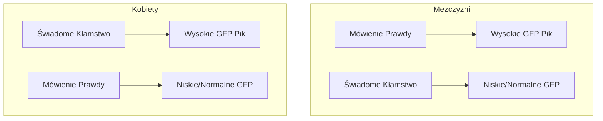
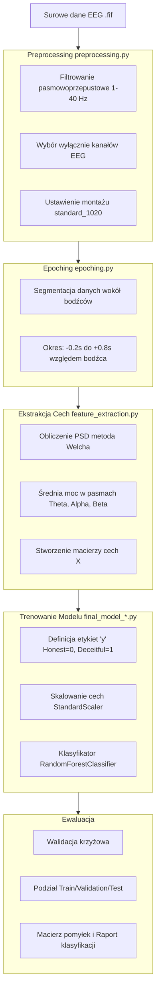

# 🧠 Neuro-Lie-Detector: Klasyfikator Prawdy i Fałszu oparty o EEG  

## 1️⃣ Wprowadzenie  

Celem tego projektu jest **analiza danych elektroencefalograficznych (EEG)** w celu stworzenia **modelu uczenia maszynowego**, który potrafi odróżnić, czy uczestnik badania mówi prawdę, czy też **świadomie kłamie**.  

Projekt opiera się na paradygmacie eksperymentalnym inspirowanym **Testem Ukrytych Informacji (Concealed Information Test, CIT)**.  
W tym podejściu analizowane są reakcje mózgu na prezentowane bodźce osobiste w celu wykrycia tzw. **„wiedzy winnego”**, czyli świadomego kłamstwa.  

Do przetwarzania i analizy sygnałów EEG wykorzystano:  
- 📦 **mne-python** – do przetwarzania i filtrowania sygnałów EEG,  
- 🌲 **scikit-learn (Random Forest)** – do budowy klasyfikatora rozróżniającego stany „prawda” i „kłamstwo”.  

---

## 2️⃣ Wyjaśnienie Zagadnień  

### ⚡ Elektroencefalografia (EEG)  

**EEG** to nieinwazyjna metoda pomiaru aktywności elektrycznej mózgu za pomocą elektrod umieszczonych na skórze głowy.  
Rejestruje ona zbiorcze **potencjały postsynaptyczne** generowane przez neurony, umożliwiając analizę stanu mózgu **w czasie rzeczywistym** z wysoką rozdzielczością czasową.  

---

# 🔍 2️⃣ Wyjaśnienie Zagadnień: ERP, P300 i Odkrycia z Badań  

---

## 🧩 2.1. Potencjały Wywołane (ERP) i Fala P300  

**Event-Related Potentials (ERP)** to mierzalne zmiany w sygnale EEG, które są **bezpośrednią odpowiedzią mózgu na określony, dyskretny bodziec**  
(np. wyświetlenie pytania, obrazu lub dźwięku).  
Analiza ERP umożliwia śledzenie procesów poznawczych z **dokładnością rzędu milisekund**, co czyni ją jednym z najważniejszych narzędzi w neurokognitywistyce.  

---

### ⚡ Fala P300 (P3b) — klucz do wykrywania kłamstw  

Fala **P300** (lub **P3b**) jest jedną z najbardziej badanych składowych ERP. Charakteryzuje się:  

- 🔺 **Dodatnim pikiem** w sygnale EEG, pojawiającym się ok. **300–600 ms po bodźcu**.  
- 🧠 **Związkiem z procesami poznawczymi**, takimi jak **ocena znaczenia bodźca** i **aktualizacja pamięci roboczej**.  
- 📈 **Większą amplitudą** w odpowiedzi na bodźce, które są **rzadkie, nieoczekiwane lub istotne osobowo**  
  (np. własne imię, data urodzenia, znajoma twarz).  

> 💡 **W kontekście wykrywania kłamstw:**  
> Fala P300 jest traktowana jako **neurologiczny wskaźnik rozpoznania informacji**, nawet jeśli badany stara się ją ukryć.  

---

## 📊 2.2. Hipoteza a Rzeczywiste Odkrycia (EDA)  

### 🧪 Klasyczna Hipoteza  
Standardowa hipoteza w badaniach typu **CIT (Concealed Information Test)** zakłada, że:  
> 👉 Bodziec istotny (np. prawdziwe dane osobowe) wywoła **silniejszą odpowiedź P300**,  
> niezależnie od tego, czy uczestnik **mówi prawdę**, czy **świadomie kłamie**.  

---

### 📈 Odkrycia Eksploracyjnej Analizy Danych (EDA)  

W projekcie przeprowadzono **Eksploracyjną Analizę Danych (EDA)** — szczegółowo przedstawioną w notebooku  
📓 *`eda_presentation.ipynb`*.  

Analiza **Global Field Power (GFP)** — czyli miary ogólnej siły sygnału EEG — ujawniła **zaskakujące różnice między płciami**:  

#### 👨 U mężczyzn  
- Wyraźny **pik aktywności GFP** obserwowano podczas **mówienia prawdy** (np. potwierdzania własnej tożsamości).  
- Reakcja na **świadome kłamstwo** była **znacznie słabsza**.  

#### 👩 U kobiet  
- Zauważono **odwrotną zależność** — silny **pik GFP** pojawiał się **podczas kłamania**.  
- Mówienie prawdy generowało **bardziej płaską i stabilną odpowiedź**.  

---

## 🧠 Wnioski z Odkryć  

To odkrycie ma **kluczowe znaczenie dla dalszego modelowania**.  
Ponieważ wzorce reakcji EEG są **fundamentalnie różne** między płciami,  
podejście typu **„jeden model dla wszystkich”** okazuje się **nieefektywne**.  

Dlatego w repozytorium znajduje się dodatkowo do testowania skrypt:  
📄 **`model_females_only.py`**  
➡️ Trenuje on klasyfikator wyłącznie na danych kobiet,  
aby sprawdzić czy model uchwyci **specyficzny wzorzec neuronalnej reakcji na kłamstwo**,
oraz czy będzie miał lepszą skuteczność.

---

📘 *Podsumowanie:*  
Eksperyment ujawnił, że **płeć uczestnika** ma znaczący wpływ na neuronalne wzorce prawdy i kłamstwa —  
co otwiera nowe kierunki badań w **neuropsychologii kłamstwa** i personalizowanym modelowaniu EEG.

---

### 📊 Gęstość Widmowa Mocy (Power Spectral Density, PSD)  

**PSD** opisuje, jak energia sygnału EEG rozkłada się pomiędzy różne **pasm częstotliwości**.  
Analiza PSD pozwala ocenić, czy **procesy kłamania** i **mówienia prawdy** różnią się pod względem aktywności w określonych zakresach:  

| Pasmo | Zakres (Hz) | Znaczenie neurofizjologiczne |
|:------|:------------:|:-----------------------------|
| **Theta** | 4–8 | Procesy pamięciowe, skupienie uwagi |
| **Alpha** | 8–13 | Stan relaksu, hamowanie informacji |
| **Beta** | 13–30 | Aktywne myślenie, stres, koncentracja |

W projekcie **cechy wejściowe modelu AI** (features) są wyznaczane jako **średnia moc sygnału** w powyższych pasmach.  

---



# ⚙️ 3️⃣ Opis Projektu i Działania  

---

## 🧠 3.1. Paradygmat Eksperymentalny  

W ramach eksperymentu uczestnikom przedstawiono **szereg zadań poznawczych**, w których mieli oni **potwierdzać lub zaprzeczać** wyświetlanym danym osobistym (np. imię, nazwisko, data urodzenia).  
Każde zadanie wymagało odpowiedzi „**Tak**” lub „**Nie**”, przy czym **znaczenie prawdy lub kłamstwa** zależało od kontekstu danego bloku.  

Eksperyment został podzielony na **cztery główne bloki**, różniące się relacją między bodźcem a oczekiwaną reakcją:  

| 🔢 **Blok** | 🧩 **Opis Zadania** | 💬 **Wymagana Odpowiedź** | 🧠 **Oczekiwany Stan** |
|:-----------:|:--------------------|:--------------------------:|:----------------------:|
| **Blok 1** | Prezentacja **prawdziwych** danych osobowych | „Tak” (potwierdzenie) | ✅ **PRAWDA** |
| **Blok 2** | Prezentacja **prawdziwych** danych osobowych | „Nie” (zaprzeczenie) | ❌ **KŁAMSTWO** |
| **Blok 3** | Prezentacja **fałszywej** tożsamości | „Tak” (potwierdzenie) | ❌ **KŁAMSTWO** |
| **Blok 4** | Prezentacja **fałszywej** tożsamości | „Nie” (zaprzeczenie) | ✅ **PRAWDA** |

---

### 💾 Struktura Danych  

Zebrane dane EEG zostały wstępnie przetworzone i zapisane w formacie **`.fif`**,  
zawierającym etykiety opisujące kontekst reakcji uczestnika:  

- 🟢 **HONEST** → odpowiedzi zgodne z prawdą (Bloki **1** i **4**)  
- 🔴 **DECEITFUL** → odpowiedzi fałszywe, czyli świadome kłamstwa (Bloki **2** i **3**)  

> 💡 Dzięki temu już na etapie surowych danych możliwe było szybkie grupowanie prób w zależności od stanu poznawczego uczestnika.  

---

## 🔄 3.2. Przetwarzanie Danych (Pipeline)  

Cały proces analizy EEG — od sygnału surowego po predykcję modelu AI — został w pełni **zautomatyzowany**.  
Pipeline przetwarzania obejmuje następujące etapy:  

1. 🧹 **Wczytanie i oczyszczenie sygnału EEG**  
   - Usunięcie artefaktów (np. mrugnięć, ruchów oczu)  
   - Filtracja pasmowa (np. 1–40 Hz)  

2. ⚙️ **Segmentacja danych (epoching)**  
   - Podział ciągłego sygnału EEG na krótkie fragmenty odpowiadające poszczególnym bodźcom  

3. 📊 **Ekstrakcja cech (feature extraction)**  
   - Obliczenie **Gęstości Widmowej Mocy (PSD)** w pasmach **Theta**, **Alpha** i **Beta**  
   - Wyznaczenie wartości średnich mocy dla każdego kanału EEG  

4. 🤖 **Uczenie modelu klasyfikacyjnego**  
   - Wykorzystanie algorytmu **Random Forest** do rozróżnienia stanów **HONEST** vs **DECEITFUL**  

5. 🔍 **Walidacja i ewaluacja**  
   - Obliczenie dokładności, macierzy pomyłek i krzywej ROC  
   - Porównanie wyników dla różnych grup (np. płeć, kanały EEG, pasma częstotliwości)  

---



📘 *Podsumowanie:*  
Sekcja eksperymentalna łączy **ściśle kontrolowany paradygmat poznawczy** z **zaawansowanym pipeline’em przetwarzania EEG**,  
umożliwiając automatyczną klasyfikację reakcji mózgu w kategoriach **prawdy** i **kłamstwa**.

---

## 4. Struktura repozytorium

.
├── dataset/                  # (Wymagany lokalnie) Folder na surowe dane EEG (.fif)
├── src/                      # Moduły Pythona zawierające logikę przetwarzania
│   ├── analysys_utils.py     # Funkcje pomocnicze do analizy i ładowania danych
│   ├── epoching.py           # Skrypt do tworzenia epok (segmentacji)
│   ├── feature_extraction.py # Skrypt do ekstrakcji cech PSD
│   └── preprocessing.py      # Skrypt do wstępnego czyszczenia danych
├── notebooks/ 
|   └── eda_presentation.ipynb    # Notebook Jupyter z Eksploracyjną Analizą Danych (EDA)
├── final_model_both.py       # Główny skrypt: trenuje model na wszystkich, używa podziału Train/Val/Test
├── final_model_cv.py         # Główny skrypt: trenuje model na wszystkich, używa Walidacji Krzyżowej (CV)
├── model_females_only.py     # Skrypt trenujący model tylko na kobietach (wynik analizy EDA)
└── requirements.txt          # Lista zależności Pythona


---

# 🧩 5️⃣ Instalacja i Uruchomienie  

## ⚙️ 5.1. Wymagania Wstępne  

Przed rozpoczęciem upewnij się, że posiadasz:  

- 🐍 **Python 3.8+**  
- 🔧 **Git**  

## 🚀 5.2. Kroki Instalacji

1.  Sklonuj repozytorium:
    ```bash
    git clone https://github.com/xVarmondx/neuro-lie-detector.git
    cd neuro-lie-detector
    ```

2.  Utwórz i aktywuj wirtualne środowisko:
    ```bash
    python -m venv venv

    # Na Linux/MacOS
    source venv/bin/activate

    # Na Windows:
    venv\Scripts\activate
    ```

3.  Zainstaluj wymagane biblioteki:
    ```bash
    pip install -r requirements.txt
    ```

### 4️⃣ 🔑 **Kluczowy krok: Przygotowanie danych**

Aby projekt działał poprawnie, konieczne jest **ręczne pobranie danych EEG** z eksperymentu.  

---

#### 📥 Pobieranie danych  

1. Utwórz folder **`dataset/`** w głównym katalogu projektu (`neuro-lie-detector/`).  
2. Wewnątrz folderu `dataset/` utwórz **podfoldery** dla każdego uczestnika,  
   nazwane ich unikalnym identyfikatorem (**UUID**).  
3. Do każdego podfolderu wgraj odpowiadające mu pliki `.fif` zawierające dane EEG.  

📎 **Link do danych:**  
[Google Drive – Neuro-Lie-Detector Dataset](https://drive.google.com/file/d/18YR2hdIq5lfktockpFT0PkXopX3kyM7U/view)  

💡 **Alternatywnie:**  
Możesz pobrać dataset z mojego brancha **`old`**, jeśli dane tam są już uporządkowane.  

---

#### 🗂️ Wymagana struktura katalogów  

    ```
    neuro-lie-detector/
    ├── dataset/
    │   ├── 2D663E30/  (Przykładowy folder uczestnika)
    │   │   ├── ...HONEST..._raw.fif
    │   │   └── ...DECEITFUL..._raw.fif
    │   ├── A511.../
    │   │   └── ...
    │   └── Ankiety.xlsx (Plik ankietowy, jeśli używany przez model_females_only.py)
    │
    ├── src/
    │   ├── preprocessing.py
    │   └── ...
    ├── final_model_both.py
    └── requirements.txt
    ```

### 🧠 5.3. Uruchamianie Modeli  

Wszystkie skrypty należy uruchamiać z poziomu **głównego katalogu projektu** (`neuro-lie-detector/`).  
Każdy z modeli realizuje inny cel analizy — od ogólnej walidacji po modele wyspecjalizowane.  

---

#### ▶️ 1️⃣ Trenowanie z Walidacją Krzyżową *(wszyscy uczestnicy)*  

**🧩 Co robi:**  
Przetwarza dane **wszystkich uczestników** i przeprowadza **5-krotną walidację krzyżową**,  
co pozwala ocenić **stabilność, ogólną dokładność i odporność modelu** na przeuczenie.  

**💻 Jak uruchomić:**  
        ```bash
        python final_model_cv.py
        ```

#### ▶️ 2️⃣ Trenowanie z podziałem Train/Validation/Test *(wszyscy uczestnicy)*  

**🧩 Co robi:**  
Wykorzystuje **stały podział danych**:  
- 🧠 **70%** – dane treningowe,  
- 🧪 **15%** – dane walidacyjne,  
- 🧾 **15%** – dane testowe.  

Model jest trenowany na całym zbiorze uczestników w celu uzyskania **jednego, finalnego klasyfikatora**, który może być później używany do predykcji nowych danych EEG.  

**💻 Jak uruchomić:**  
        ```bash
        python final_model_both.py
        ```

#### ▶️ 3️⃣ Trenowanie modelu tylko dla kobiet *(na podstawie EDA)*  

**🧩 Co robi:**  
Wczytuje plik **`Ankiety.xlsx`** znajdujący się w folderze `dataset/`,  
następnie **filtruje uczestników płci żeńskiej** i trenuje model wyłącznie na tym podzbiorze danych.  

To podejście wynika z odkryć **Eksploracyjnej Analizy Danych (EDA)**,  
która wykazała istotne różnice w aktywności mózgu między płciami  
podczas mówienia prawdy i kłamania.  

**💻 Jak uruchomić:**  
```bash
python model_females_only.py
```

### 📊 5.4. Eksploracyjna Analiza Danych (EDA)  

Aby przeprowadzić szczegółową analizę sygnałów EEG, obejmującą:  
- wizualizacje **fal ERP (Event-Related Potentials)**,  
- mapy topograficzne aktywności mózgu (**topomapy**),  
- porównania między warunkami **HONEST** i **DECEITFUL**,  

uruchom notatnik Jupyter z folderu głównego projektu.

---

#### ▶️ 1️⃣ Uruchomienie serwera Jupyter  

W terminalu (będąc w katalogu `neuro-lie-detector/`) wpisz:  
```bash
jupyter lab
```

If your browser does not open automatically, the console will display an address to copy.

```bash
http://localhost:8888/?token=... (a very long string of characters)
```

OR

```bash
http://127.0.0.1:8888/?token=... (a very long string of characters)
```

1. Copy one of these links — the entire URL, including `?token=...`  
2. Paste it into your browser's address bar and press Enter.  

This will open the Jupyter dashboard. From there, you can click the `notebooks` folder, and then open the file `eda_presentation.ipynb`.


📘 *Podsumowanie:*  
Projekt **Neuro-Lie-Detector** łączy analizę EEG, przetwarzanie sygnałów i uczenie maszynowe, aby w sposób obiektywny badać reakcje mózgu towarzyszące **kłamstwu i prawdzie**.
